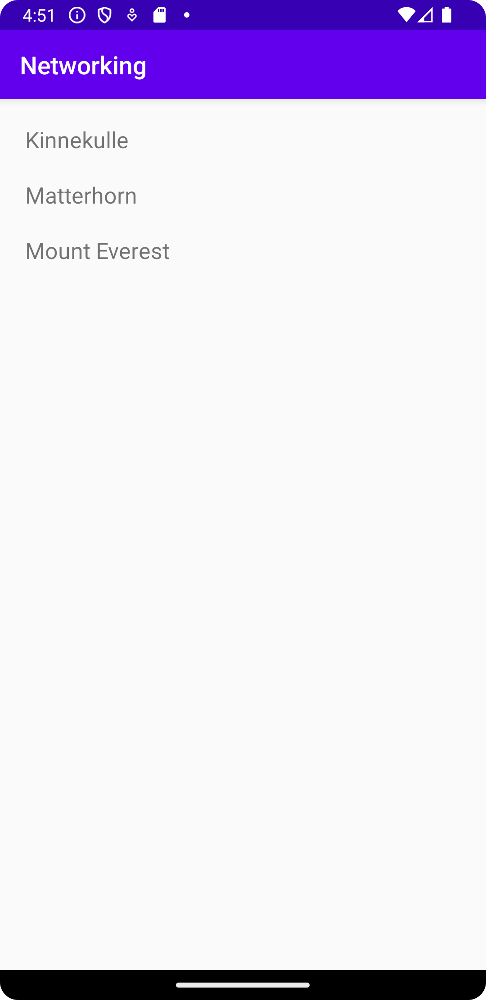

# Rapport
Det första som gjordes var att lägga till en recycler view. 
Sedan behövdes en mountain class göras och skrivas in data i den, mountain klassen gjordes sedan till en array.
En recycleviewadapter klass har också skapats för att kunna skriva ut namnen på bergen. Sedan användes Gson för att kunna parsa ut Json data som bergen låg i.

```
<androidx.recyclerview.widget.RecyclerView
        android:id="@+id/recycler_view"
        android:layout_width="match_parent"
        android:layout_height="match_parent"
        app:layout_constraintBottom_toBottomOf="parent"
        app:layout_constraintLeft_toLeftOf="parent"
        app:layout_constraintRight_toRightOf="parent"
        app:layout_constraintTop_toTopOf="parent" />
```

```
public class Mountain {

    public String ID;
    @SerializedName("name")
    public String name;

    public Mountain() {
        name = "Namn:";
    }

    public Mountain(String name) {
        this.name = name;
    }

    @NonNull
    @Override
    public String toString() {
        return name;
    }

    public String getTitle() {
        return name;
    }
}
```

```
RecyclerViewAdapter adapter = new RecyclerViewAdapter(this, mountainlist, new RecyclerViewAdapter.OnClickListener() {
            @Override
            public void onClick(Mountain item) {
                Toast.makeText(MainActivity.this, item.toString(), Toast.LENGTH_SHORT).show();
            }
        });
```
```
Gson gson = new Gson();
        Type type = new TypeToken<List<Mountain>>() {
        }.getType();
        mountainlist = gson.fromJson(json, type);
```

Bilder läggs i samma mapp som markdown-filen.



